# Analyse de Données et Visualisation

## Présentation

Ce projet propose une interface interactive pour l'analyse de données et la visualisation. Il permet aux utilisateurs d'importer des fichiers Excel, d'explorer les données, de calculer des statistiques et de générer divers types de visualisations et de distributions de probabilités.

---

## Fonctionnalités

- **Importation et aperçu des données :** Affichage des premières lignes pour un aperçu rapide.  
- **Statistiques descriptives :** Calcul de la moyenne, médiane, mode, variance, écart type et étendue.
- **Visualisations interactives :** Histogramme, Boxplot, KDE Plot, Scatterplot, Heatmap,Countplot, Pie Chart, Barplot et Violin Plot.  
- **Probabilités :** Analyse des distributions discrètes (Bernoulli, Binomiale, Poisson, Uniforme) et continues (Uniforme, Exponentielle, Normale). 
- **Choix personnalisés :** L'utilisateur peut sélectionner les colonnes et les conditions pour ses visualisations et calculs.  

---

## Aperçu des fonctionnalités

### Aperçu des données
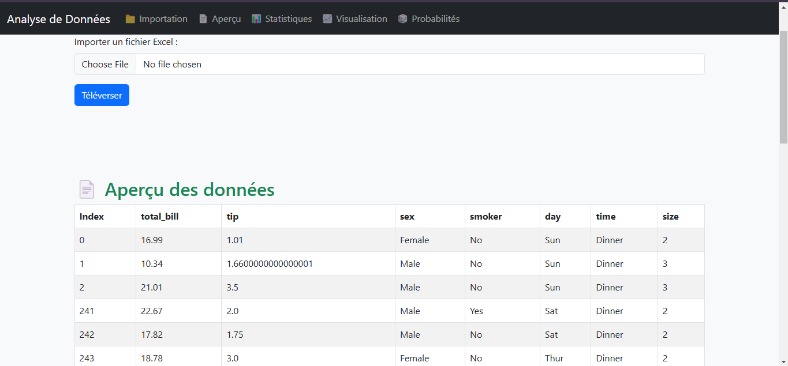

### Calcul des Statistiques
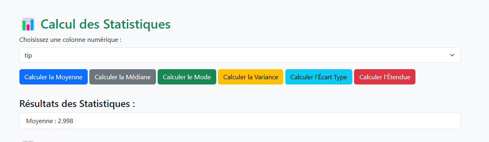

### Visualisations
Exemples :  
- **Heatmap :** 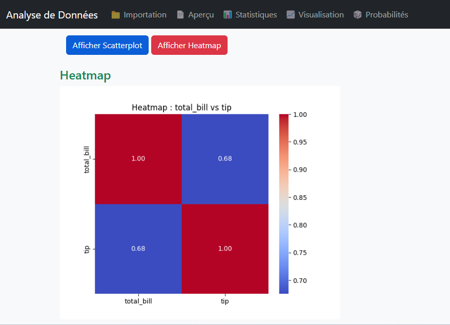  
- **Histogramme :** 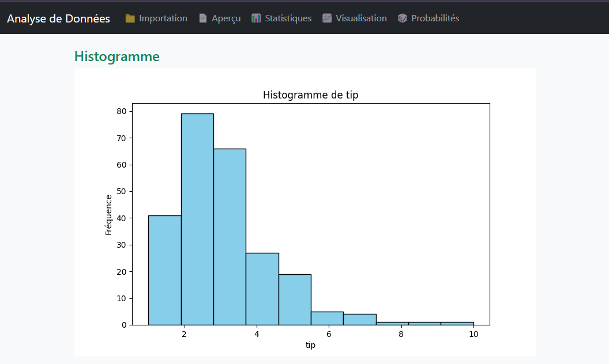  
- **Violin Plot :** 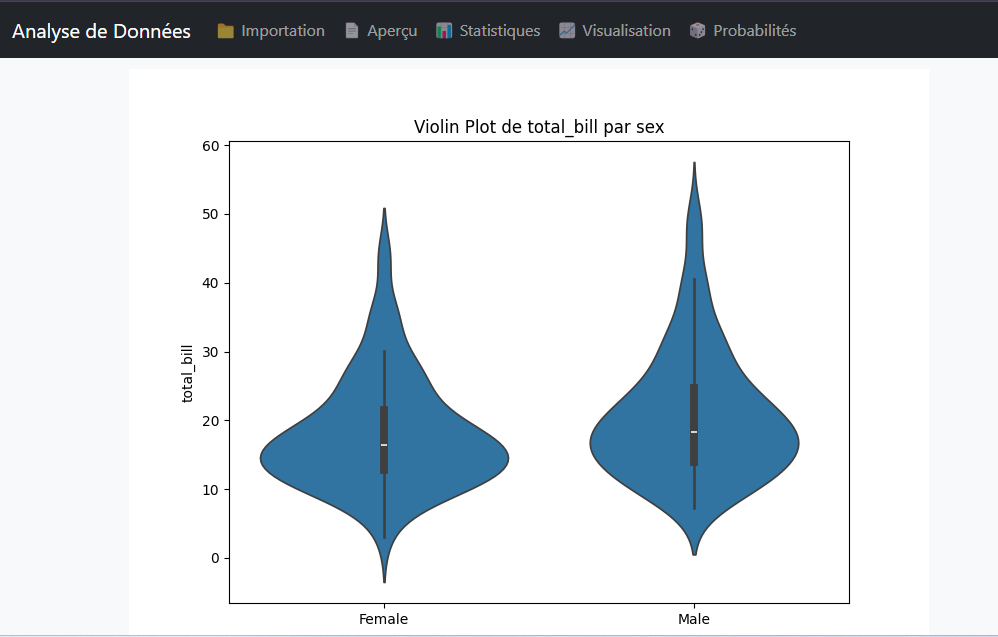  
- **Pie Chart :** 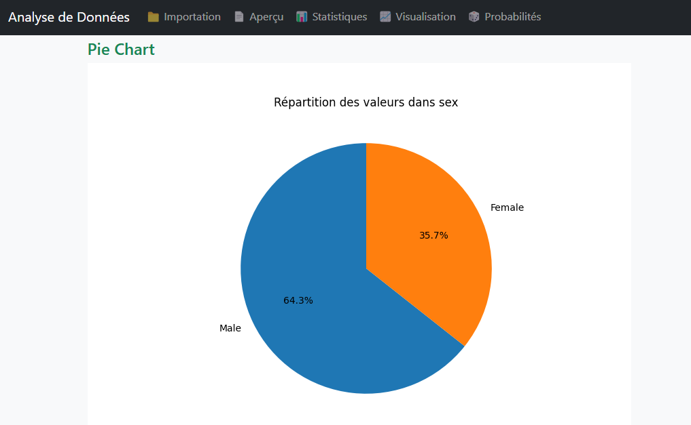  

### Probabilités 
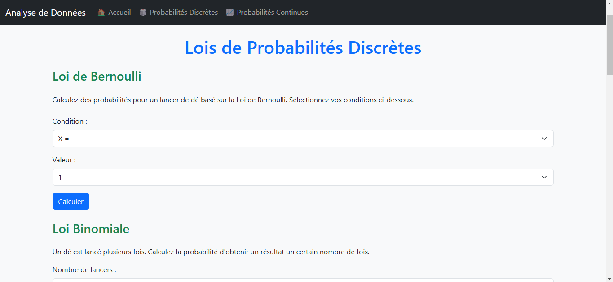 
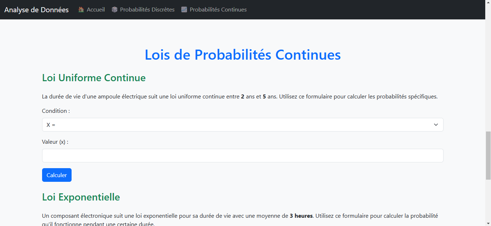
Exemples :  
- **Bernoulli :** 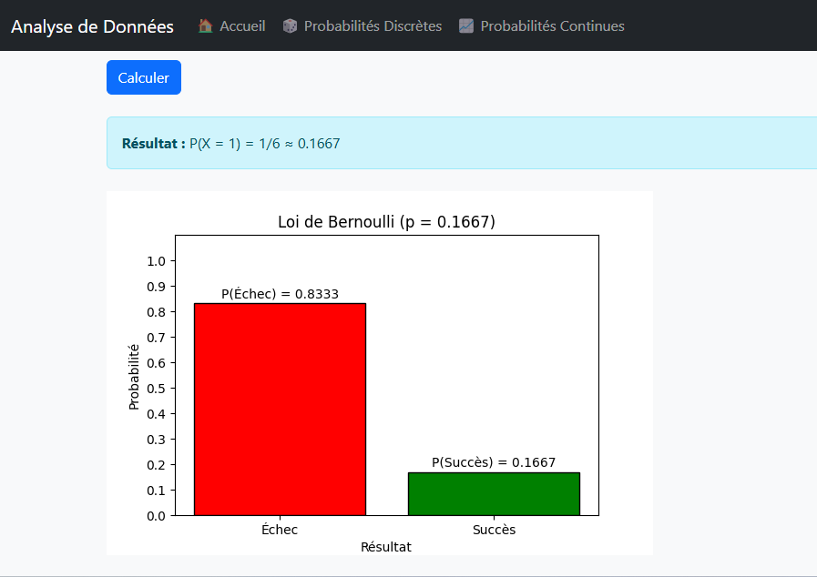  
- **Uniforme Discontinue :** 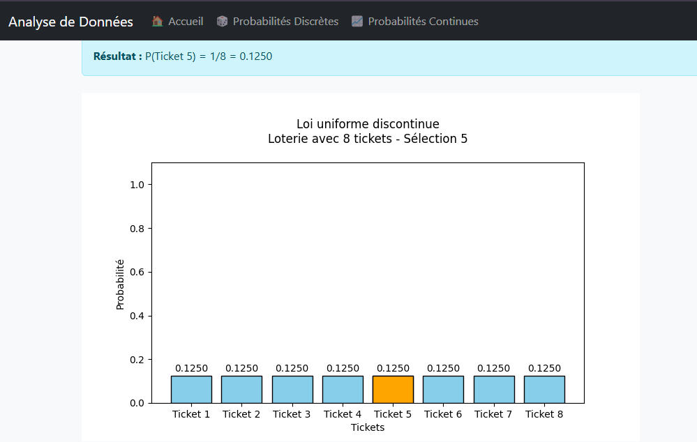  
- **Normale Gaussienne :** 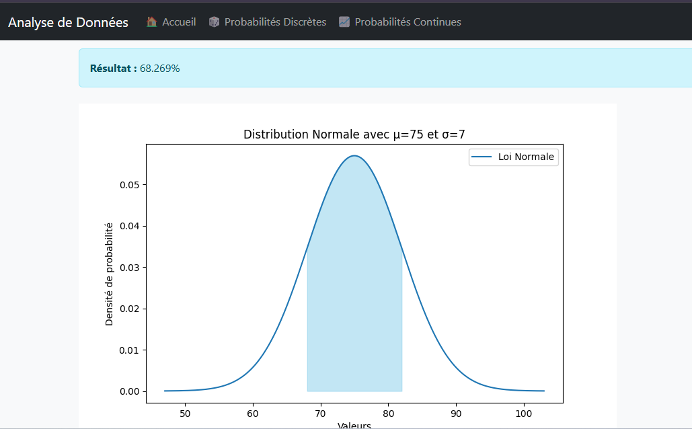  

---

## Prérequis

- Python 3.12.5 ou plus récent  
- Django 5.1.4 ou plus récent  
- Bibliothèques nécessaires (voir `requirements.txt`)  

---

## Installation

1. Clonez le dépôt :
   ```bash
   git clone https://github.com/DouaaElMalky/Data_Analysis_Visualization_Django

2. Créez un environnement virtuel :
   ```bash
   python -m venv env
   ```
3. Activez l'environnement virtuel :
   ```bash
   .\env\Scripts\activate
   ```
4. Installez les dépendances :
   ```bash
   pip install -r requirements.txt
   ```
---

### Contributors

- **EL MALKY Douaa**
- **RAHHALI Asmaa**